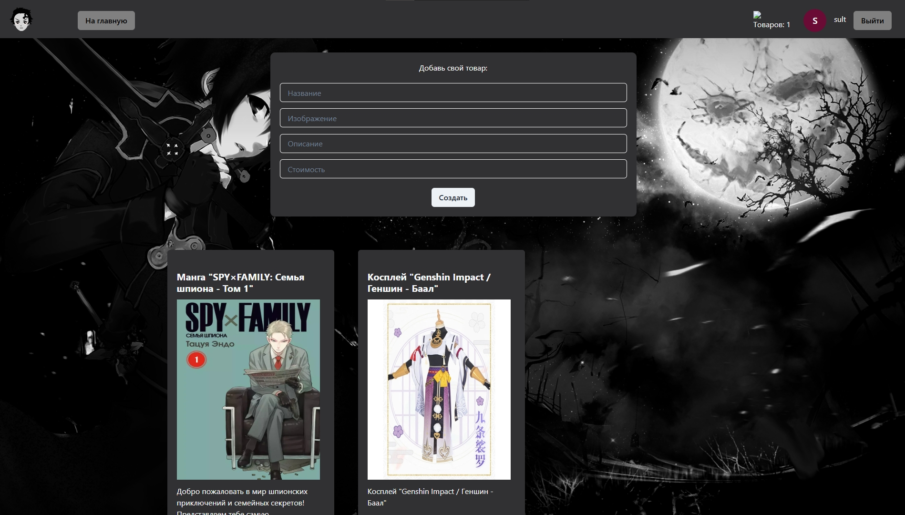
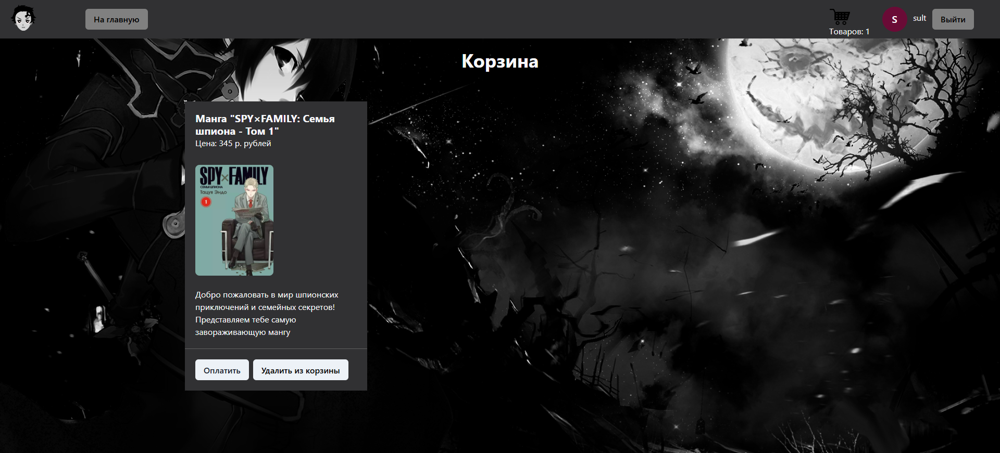
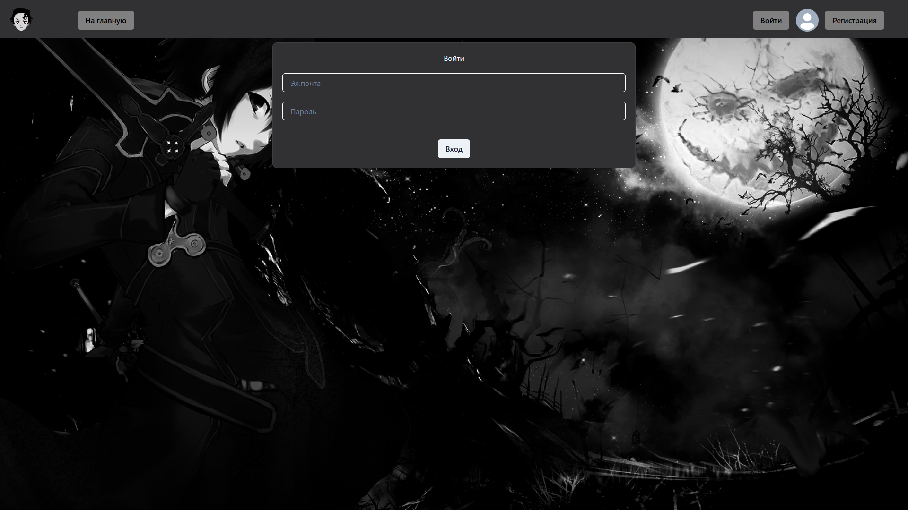

# 🛒 AnimeStore

Fullstack web application for an anime store.

## 📸 Screenshots

### Product Catalog



### Shopping Cart



### Authentication



## 🛠 Tech Stack

### Frontend

- React 18
- Vite
- React Router
- Axios
- Chakra UI
- Framer Motion

### Backend

- Node.js
- Express.js
- Sequelize ORM
- PostgreSQL
- JWT
- bcrypt

## ✨ Features

- User registration and authentication
- Product catalog
- Product creation
- Product deletion
- Shopping cart
- REST API
- PostgreSQL database

## 🚀 Getting Started

### Server

```bash
cd server
npm install
npm run dev

# Client — в отдельном терминале
cd client
npm install
npm run dev